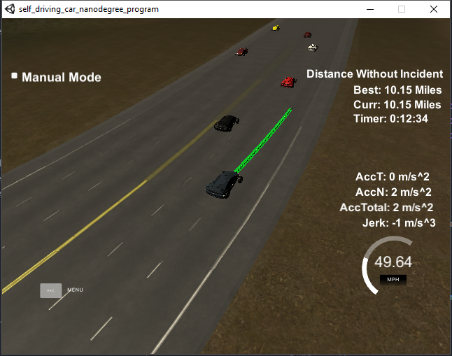
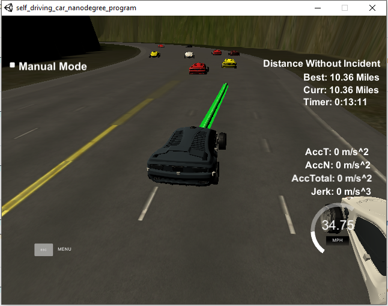
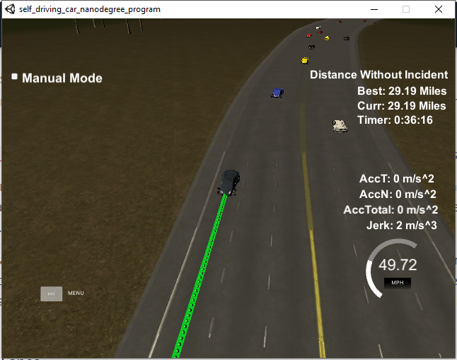

# CarND-Path-Planning-Project
Self-Driving Car Engineer Nanodegree Program

## code Structure
`src/main.cpp`: the file serve to interface between the simulator and the algorithm.

`src/bp.cpp` : Behavior_Planner class, used for planning and generating trajectories.

`src/helper.cpp` : encapsulation of all the helper functions.

## Rubric Points
1. The car is able to drive at least 4.32 miles without incident:
2. The car drives according to the speed limit.
3. Max Acceleration and Jerk are not Exceeded.
4. Car does not have collisions.
5. The car stays in its lane, except for the time between changing lanes.
6. The car is able to change lanes
The pictures below are the proof for the points above:





## Reflection
The algorithm contains three parts:
- Planning
- State machine
- Trajectory generation
The approach is rather heuristic and a more advanced version will be investigated based on complete prediction. So for the decision making rules are rather conservative but it works fine with satisfying the project requirement. Also, it should be noticed that the simulation environment is quite random so it is impossible to guarantee a perfect solution without sampling lots of environment conditions.

#### 1. Planning
This part is located at `bp.cpp` within line 40-81, where in the beginning the sensor fusion is used to provide the feasible velocities of all the lanes for both front and behind. For each lane, the algorithm consider the closest vehicle in each lane with respect to Frenet d-coordinate. The cost function is then constructed from three parts:
```c++
for(int i = 0; i <=2; i++)
  cost[i] = pow(goal_v_-ahead_v[i],2) + (cooling_*cooling_+5.0)*pow(lane_id_-i,2) + 5.1*pow(1-i,2);
```
where the first part is the velocity square, the second part the lane changing cost, and the final part the bias-toward-center-lane cost. It should also be mentioned that the `cooling_` weight is used to indicated that the ego vehicle just completed a lane change so it for a certain time, a lane changing action should be prevented.

After computing the costs for every land, the algorithm proceed to propose a preferred lane, ` prefer_lane`.

#### 2. State machine
This part is located at `bp.cpp` within line 88-111, where the preferred lane was given by the planner such that the next states can be decided. In fact, I did not implement the prepare states as I think by keeping only three states, KeepLand, ChangeLeft, ChangeRight, it is simpler to implement. Thus, it is a fairly simple state machine and the logics are check by each state block. The main efforts focus on the KeepLane state:
``` c++
if (state_ == "KL"){
  if(prefer_lane != lane_id_){
    int id = lane_id_ + (prefer_lane>lane_id_? 1:-1);
    bool cond1 = car_s_end > (behind_s[id] + 10);
    bool cond2 = car_v_end > (behind_v[id]);
    bool cond3 = car_s_end < (ahead_s[id] - 10);
    bool cond4 = car_v_end < ahead_v[id];
    // bool cond5 = car_v_end > 30 * MPH2MPS; // in m/s
    if ( cond1 && cond2 && cond3 && cond4){
      next_state = prefer_lane > lane_id_ ? "CR":"CL";
      lane_id_ += prefer_lane > lane_id_ ? 1:-1;
      cooling_ = 10;
    }
  }
}
```
Basically, all the conditions are checked to ensure that such a change of lane is feasible. For both the ChnageLeft and ChangeRight states, the code is just to make sure that the desired d position has been reached and the machine returns back to the KeepLane state.

#### 3. Trajectory generation
This part is located at `bp.cpp`within line 127-228. The main part is pretty similar to the Walkthrough video so I will just mention about the modification. First, I develop the speed controller to ensure that the ego vehicle is not going to crash the cars in the front. It's a fairly simple logic by checking if the distance to the closet front car is within the safe distance (`dist_safe = 35 * ref_v_/goal_v_;`) and reducing the speed (with maximum allowed negative acceleration) to the highest possible lane speed, which is the speed of the front car. If there are no cars ahead of the ego, the speed is increased to the maximum allowed speed ~ 50MPH.

## Improvement
1. I was able to ran the simulator without any issues around 50 mins, but I am not sure whether the algorithm is perfect or not as I did not test it for a whole day. Maybe, for the follow-up tasks, the algorithm should be tested for longer than a day to ensure reliability.



2. The prediction part was done rather in a simple fashion, and I think a more complete version should be like what the classroom suggests:
  - generate trajectories by sampling different parameters with consideration of predictions
  - remove the infeasible ones
  - compute the costs of remaining feasible trajectories
  - pick the lowest cost and its trajectory
